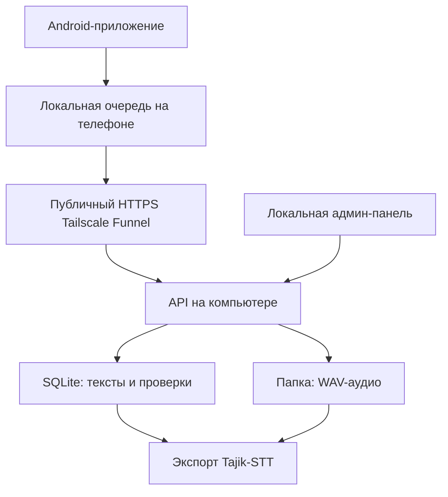

# Tajik STT Collector

Минималистичное Android-приложение для добровольного сбора и проверки таджикской речи. Добровольцы могут работать из любой сети, но облачной базы нет: тексты, проверки и метаданные сохраняются в SQLite на компьютере владельца, а WAV-файлы — в его локальной папке.

## Что уже есть

- **Сабти овоз** — пять последовательных WAV-записей с прогрессом; на проверку отправляется только полная пятёрка.
- **Иловаи матн** — доброволец предлагает новый таджикский текст и при желании указывает источник.
- **Санҷиши матн** — принять, исправить или отклонить текст.
- **Санҷиши сабт** — прослушать запись, сопоставить с текстом, принять или отклонить.
- Один текст собирает до **5 голосов разных добровольцев**.
- Текст и аудио принимаются после **2 независимых положительных проверок**.
- Доброволец не может проверять собственную запись или собственный текст.
- Если компьютер временно недоступен, WAV остаётся на телефоне и попадает в очередь повторной отправки.
- Светлая и тёмная темы переключаются на главном экране.
- После подтверждённой загрузки на сервер очередь очищается, а её локальная WAV-копия удаляется с телефона.
- Экспорт в пары `UUID.wav + UUID.txt` и `manifest.jsonl` для Tajik-STT.
- Без регистрации: приложение автоматически создаёт анонимный `volunteer_id` и случайный 256-битный device credential.

## Архитектура MVP



Backend написан только на стандартной библиотеке Python: устанавливать FastAPI, PostgreSQL или Docker не нужно.

## Анонимная аутентификация добровольца

Регистрации, email, телефона, Google/Firebase login и пользовательского пароля нет. При первом запуске Android сохраняет в закрытом хранилище приложения:

- постоянный случайный `volunteer_id`;
- случайный 256-битный `device_secret`.

После регистрации каждый персональный volunteer API-запрос отправляет `volunteer_id` в HTTP-заголовке `X-Volunteer-Id`, а secret — только в `Authorization: Bearer ...`. Secret не помещается в URL, публичный `app-config.json`, Git или обычные server logs.

На ПК plaintext secret не сохраняется. SQLite хранит только случайную соль и `SHA-256(salt || secret)`. Такой быстрый hash используется намеренно, потому что device secret — не человеческий пароль, а случайное 256-битное значение.

Новая установка и однократная миграция старой установки проходят короткий proof-of-work challenge без CAPTCHA и действий пользователя. После привязки credential повторный запуск/фоновая отправка challenge больше не требуют. Backend также применяет отдельные device rate limits для получения задач, статистики, добавления текстов, reviews и WAV upload. IP используется только как дополнительный aggregate signal; если Funnel скрывает исходный IP и backend видит loopback, IP-limit не применяется ко всем пользователям как к одному человеку.

Это затрудняет массовое создание фальшивых UUID и автоматическое отравление корпуса, но не обещает абсолютную Sybil-защиту против распределённого атакующего с большим количеством устройств/IP/вычислительных ресурсов.

### Миграция существующих установок

Обновление сохраняет уже существующий `volunteer_id`, локальную SQLite-очередь и WAV-файлы. Если у старой установки ещё нет device secret, приложение генерирует его один раз. Сервер разрешает однократно привязать credential к старому UUID только после proof-of-work и при совпадении сохранённого display name; после этого UUID без правильного bearer token больше не является авторизацией.

## Онлайн-запуск на Windows

Так приложение работает через мобильный интернет и любой Wi‑Fi, а данные всё равно остаются на вашем ПК. Проброс портов на роутере не нужен.

### 1. Установить серверные программы

- Python 3.10 или новее;
- [Tailscale для Windows](https://tailscale.com/download/windows), затем войти в аккаунт.

### 2. Запустить компьютер как онлайн-сервер

Откройте папку `backend` и дважды нажмите:

```text
run_online_server.bat
```

При первом запуске Tailscale может открыть браузер и попросить разрешить **Funnel**. Разрешите его один раз. В окне появятся:

- постоянный адрес вида `https://имя-компьютера.имя-сети.ts.net`;
- отдельный ключ администратора.

Добровольцам пароль или ключ не нужен. Ключ администратора не публикуйте: он создаётся случайно и сохраняется только в `backend/runtime/online_config.json` на этом ПК.

### 3. Открыть закрытую админ-панель

```text
http://127.0.0.1:8001/admin
```

Введите **ключ администратора** из окна сервера. Эта страница привязана к `127.0.0.1` и не публикуется через Funnel.

### 4. Добавить тексты

В локальной панели:

1. Укажите источник.
2. Вставьте тексты — один фрагмент на каждой строке.
3. Для немедленной записи включите **«Сразу разрешить запись»**.
4. Нажмите **«Добавить»**.

Без галочки каждый текст сначала должен получить две проверки в разделе `Санҷиши матн`. Тексты, предложенные добровольцами через `Иловаи матн`, всегда начинают со статуса ожидания и проверяются другими участниками.

Можно также перетащить TXT или CSV на `backend/import_texts.bat`. CSV поддерживает столбцы `text` и `source`.

### 5. Указать публичный сервер для приложения

Откройте `docs/app-config.json` и один раз запишите адрес Funnel:

```json
{
  "server_url": "https://имя-компьютера.имя-сети.ts.net"
}
```

После публикации GitHub Pages приложение само получает этот адрес. При смене сервера достаточно обновить JSON — пересобирать APK не требуется.

### 6. Запустить Android-приложение

1. Откройте папку `android` в Android Studio.
2. Дождитесь Gradle Sync.
3. Подключите Android-телефон и нажмите **Run**.
4. При первом запуске доброволец вводит имя, при желании указывает регион и подтверждает согласие.

Телефону добровольца не нужны пароль, ключ, адрес сервера, аккаунт или приложение Tailscale. Device credential создаётся приложением автоматически и пользователю не показывается.

### Что произойдёт при выключении ПК или интернета

- Уже принятые WAV и SQLite останутся на ПК.
- Приложение временно не сможет получить новые задания и отправить проверки.
- Записанный, но не отправленный WAV останется в закрытой очереди телефона.
- Когда ПК, сервер и интернет снова заработают, Android повторит отправку автоматически.
- Сам сайт и страница скачивания APK продолжат работать, потому что размещены на GitHub Pages.

После перезагрузки ПК снова запустите `backend/run_online_server.bat`. Фоновая настройка Funnel сохраняется, однако Python-сервер необходимо запустить заново.

Чтобы закрыть публичный адрес, запустите `backend/stop_online_funnel.bat`. Это не удаляет базу или записи.

## Локальный режим для разработки

Для теста без интернета запустите `backend/run_server.bat`. Телефон и ПК должны быть в одной Wi‑Fi-сети; адрес можно узнать командой `ipconfig`, например `http://192.168.1.25:8000`.

Volunteer API и в локальном режиме использует тот же анонимный device credential. Отдельный `tajik-stt-local` key относится только к локальным admin API и не встраивается в Android.

Для Android Emulator используется адрес `http://10.0.2.2:8000`.

Обычный HTTP разрешён только в `debug`-сборке. `release`-сборка принимает только HTTPS-серверы и использует HTTPS Tailscale Funnel.

## Где находятся данные

```text
backend/runtime/collector.db     # тексты, добровольцы, hashed device credentials и проверки
backend/runtime/audio/           # исходные WAV-записи
```

Эти каталоги исключены из Git: реальные голоса добровольцев нельзя случайно отправить в публичный репозиторий.
WAV появляется в `runtime/audio` сразу после успешной отправки с телефона, ещё до проверки; статус `pending`, `approved` или `rejected` хранится в `collector.db`.

## Экспорт для Tajik-STT

```powershell
cd backend
py -3 server.py export --output exports\dataset-v1
```

Результат:

```text
exports/dataset-v1/manifest.jsonl
exports/dataset-v1/audio/<recording-id>.wav
exports/dataset-v1/audio/<recording-id>.txt
```

## Проверки backend

```powershell
cd backend
py -3 -m unittest discover -s tests -v
```

Никаких внешних Python-зависимостей нет.

## Сайт и публичная загрузка APK

Мобильный лендинг, политика конфиденциальности и условия использования находятся в `docs/` и готовы для GitHub Pages.

После объединения изменений:

1. Откройте `Settings → Pages`.
2. В `Build and deployment` выберите `Deploy from a branch`.
3. Выберите ветку `main`, папку `/docs` и нажмите `Save`.
4. Сайт появится по адресу `https://zigger06.github.io/Tajik-STT-Collector/`.

Кнопка на сайте скачивает файл `Tajik-STT-Collector.apk` из последнего GitHub Release. Публичный APK создаётся только workflow `Actions → Publish release APK`, только из `main` и только при настроенном постоянном release keystore.

> Для свободного доступа добровольцев сайт и APK должны быть публичными. На GitHub Free для Pages нужен публичный репозиторий; файл Release из приватного репозитория также требует входа и доступа.

## Что установить для сборки Android

- Android Studio с Android SDK;
- Android SDK Platform 35 и Build Tools 35.x через SDK Manager;
- JDK 17 (встроенного JDK Android Studio обычно достаточно);
- драйвер телефона на Windows, только если устройство не определяется через USB.

Отдельно устанавливать Gradle не нужно: проект использует Gradle Wrapper. Для локального backend нужен Python 3.10 или новее, внешних пакетов нет.

Debug-сборка из терминала Android Studio:

```powershell
cd android
.\gradlew.bat testDebugUnitTest assembleDebug
```

Готовый debug-файл появится здесь:

```text
android/app/build/outputs/apk/debug/app-debug.apk
```

## Release signing

Production keystore не хранится в репозитории. Gradle читает его только из переменных окружения:

- `ANDROID_RELEASE_KEYSTORE_PATH`
- `ANDROID_RELEASE_STORE_PASSWORD`
- `ANDROID_RELEASE_KEY_ALIAS`
- `ANDROID_RELEASE_KEY_PASSWORD`

GitHub Actions восстанавливает keystore из секрета `ANDROID_RELEASE_KEYSTORE_BASE64` и использует ещё три Actions secrets с теми же паролем/alias. Workflow перед публикацией проверяет наличие signing-конфигурации и подпись готового APK через `apksigner`.

Keystore создаётся владельцем проекта один раз и должен иметь отдельную резервную копию вне Git. Не меняйте его между релизами: Android считает APK с другой подписью другим издателем.

> APK, опубликованные до перехода на постоянный release key, были debug-signed. Такой APK нельзя обновить поверх установленной debug-версии новым release-signed APK. Перед первым переходом сохраните/дождитесь отправки локальной очереди, удалите старую test-версию и затем установите release-сборку.

## Ограничения первого MVP

- Компьютер, Python-сервер, Tailscale и интернет должны работать во время синхронизации.
- Tailscale Funnel пока помечен как beta и имеет неконфигурируемые ограничения пропускной способности; для массового корпуса позже может понадобиться выделенный туннель или VPS.
- Публичный API и локальная админ-панель разделены. Не перенаправляйте порт `8001` наружу.
- Rate limits хранятся в памяти процесса и сбрасываются при перезапуске backend; proof-of-work и device credential всё равно остаются обязательными для новых устройств.
- `/media/<recording-id>.wav` намеренно не переводился на короткоживущие reviewer tokens в этом этапе: это отдельная security-задача №4.
