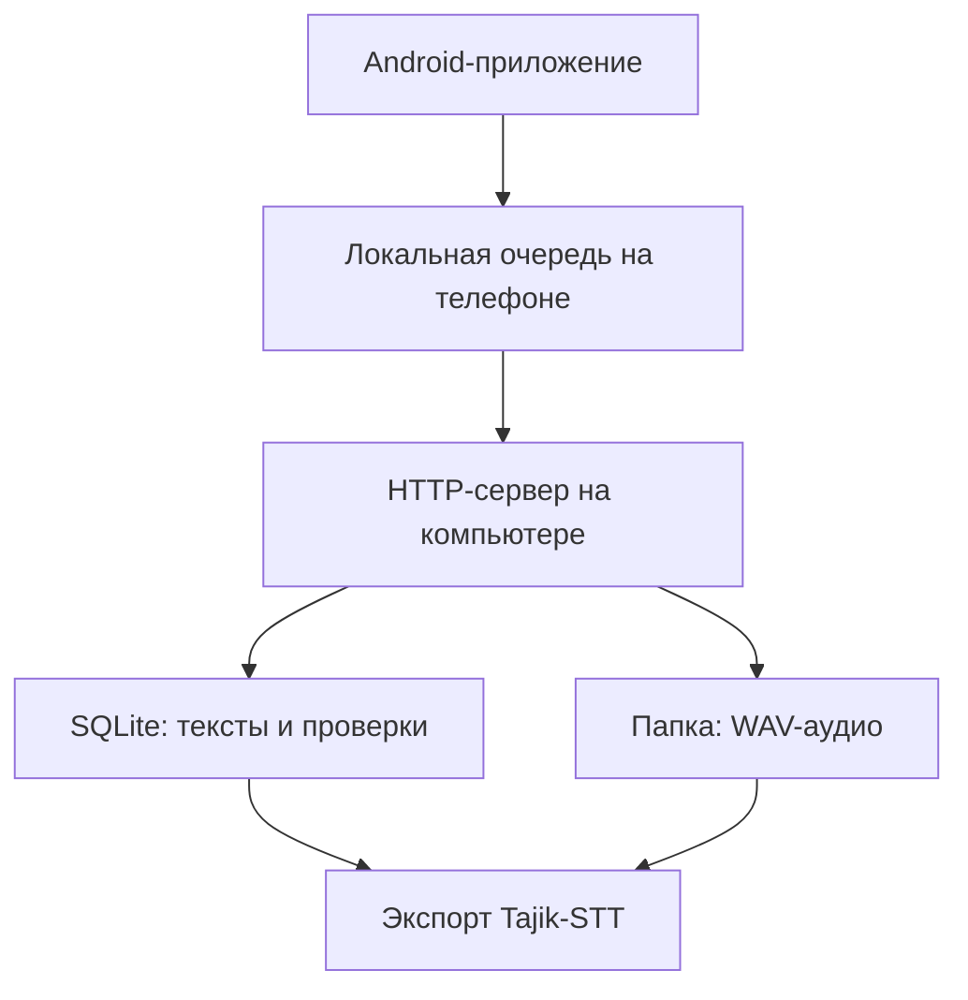

# Tajik STT Collector

Минималистичное Android-приложение для добровольного сбора и проверки таджикской речи. Первая версия работает без облачной базы: тексты, проверки и метаданные сохраняются в SQLite на компьютере, а WAV-файлы — в локальной папке.

## Что уже есть

- **Сабти овоз** — чтение текста, WAV-запись, прослушивание и отправка одной кнопкой.
- **Санҷиши матн** — принять, исправить или отклонить текст.
- **Санҷиши сабт** — прослушать запись, сопоставить с текстом, принять или отклонить.
- Один текст собирает до **5 голосов разных добровольцев**.
- Текст и аудио принимаются после **2 независимых положительных проверок**.
- Доброволец не может проверять собственную запись.
- Если компьютер временно недоступен, WAV остаётся на телефоне и попадает в очередь повторной отправки.
- Экспорт в пары `UUID.wav + UUID.txt` и `manifest.jsonl` для Tajik-STT.

## Архитектура MVP



Backend написан только на стандартной библиотеке Python: устанавливать FastAPI, PostgreSQL или Docker не нужно.

## Быстрый запуск на Windows

### 1. Запустить компьютер как локальный сервер

Откройте папку `backend` и дважды нажмите:

```text
run_server.bat
```

Затем откройте локальную панель:

```text
http://localhost:8000/admin
```

Ключ первой версии:

```text
tajik-stt-local
```

При первом запуске Windows может спросить доступ к сети — разрешите доступ для частной сети.

### 2. Добавить тексты

В локальной панели:

1. Укажите источник.
2. Вставьте тексты — один фрагмент на каждой строке.
3. Для немедленной записи включите **«Сразу разрешить запись»**.
4. Нажмите **«Добавить»**.

Без галочки каждый текст сначала должен получить две проверки в разделе `Санҷиши матн`.

Можно также перетащить TXT или CSV на `backend/import_texts.bat`. CSV поддерживает столбцы `text` и `source`.

### 3. Узнать адрес компьютера

В PowerShell выполните:

```powershell
ipconfig
```

Найдите IPv4 компьютера, например `192.168.1.25`. Телефон и компьютер для первого теста должны быть подключены к одной Wi-Fi-сети.

### 4. Запустить Android-приложение

1. Откройте папку `android` в Android Studio.
2. Дождитесь Gradle Sync.
3. Подключите Android-телефон и нажмите **Run**.
4. При первом запуске заполните профиль.
5. Введите сервер: `http://192.168.1.25:8000` — замените IP своим.
6. Введите ключ `tajik-stt-local`.

Для Android Emulator используется адрес `http://10.0.2.2:8000`.

## Где находятся данные

```text
backend/runtime/collector.db     # тексты, добровольцы и проверки
backend/runtime/audio/           # исходные WAV-записи
```

Эти каталоги исключены из Git: реальные голоса добровольцев нельзя случайно отправить в публичный репозиторий.

## Экспорт для Tajik-STT

```powershell
cd backend
py -3 server.py export --output exports\dataset-v1
```

Результат:

```text
exports/dataset-v1/manifest.jsonl
exports/dataset-v1/audio/<recording-id>.wav
exports/dataset-v1/audio/<recording-id>.txt
```

## Проверки backend

```powershell
cd backend
py -3 -m unittest discover -s tests -v
```

Никаких внешних Python-зависимостей нет.

## Ограничение первого MVP

Без туннеля компьютер доступен только устройствам в той же локальной сети. Для добровольцев из других мест следующим шагом можно подключить защищённый туннель, не перенося SQLite и WAV в облако.
